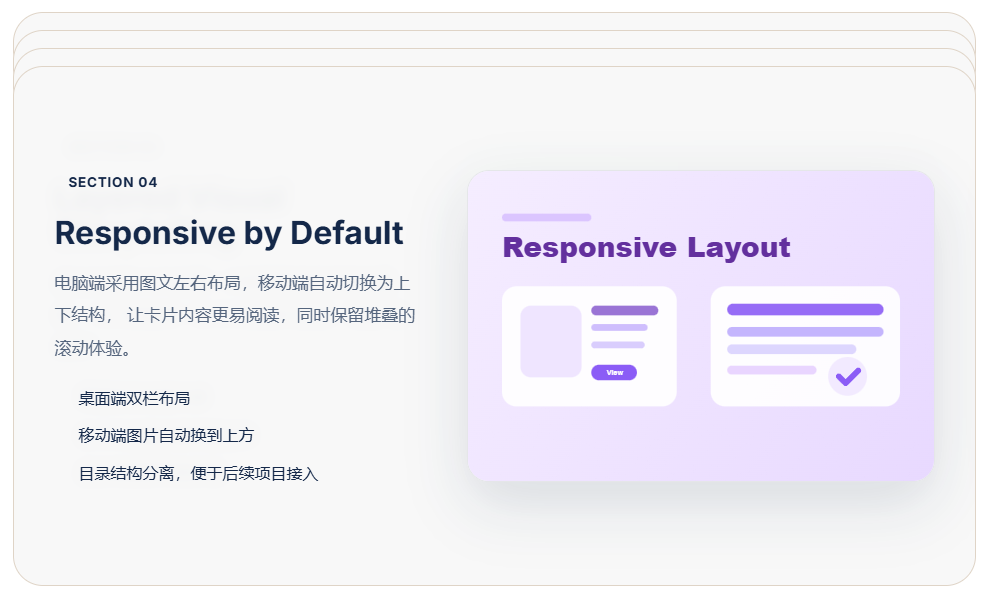

# Sticky Stacked Cards Section

一个基于 **HTML + CSS + JavaScript** 实现的滚动错层堆叠卡片页面示例。

页面结构包含：

- 上方普通内容 Section
- 中间 Sticky 错层堆叠卡片 Section
- 下方普通内容 Section

这样可以更直观地观察：当页面从上方内容滚动进入中间堆叠区域、卡片逐张叠加、再滚动离开到下方内容区域时，整体页面的滚动表现。

---

## 效果预览



---

## 项目特点

- 使用 `position: sticky` 实现滚动吸附效果
- 多张卡片向下滚动时依次叠加
- 向上滚动时卡片依次展开
- 每张卡片拥有独立的错层偏移，视觉上更有层次感
- 使用 `z-index` 控制后续卡片覆盖前一张卡片
- 上下增加普通 Section，方便测试嵌入完整页面后的效果
- 图片使用本地 SVG 占位图，无需依赖外部图片资源
- CSS、JS、图片资源分目录管理，便于后续维护
- 支持响应式布局，适配桌面端和移动端

---

## 页面结构说明

当前页面主要分为三部分：

```text
Top Section
普通页面内容，用于测试进入堆叠区域前的滚动效果

Sticky Stack Section
核心错层堆叠卡片区域

Bottom Section
普通页面内容，用于测试离开堆叠区域后的滚动效果
```

核心效果位于中间的堆叠卡片 Section 中。

---

## 目录结构

```text
sticky-stacked-cards-section/
├── index.html
├── assets/
│   ├── css/
│   │   └── style.css
│   ├── js/
│   │   └── main.js
│   └── images/
│       ├── placeholder-1.svg
│       ├── placeholder-2.svg
│       ├── placeholder-3.svg
│       └── placeholder-4.svg
└── docs/
    └── screenshots/
        └── sticky-stacked-cards-preview.png
```

说明：

- `index.html`：页面 HTML 结构
- `assets/css/style.css`：页面样式和 sticky 堆叠逻辑
- `assets/js/main.js`：简单滚动状态脚本
- `assets/images/`：SVG 占位图片
- `docs/screenshots/`：GitHub README 预览截图目录

---

## 核心实现原理

该效果的核心是 CSS 的 `position: sticky`。

每张卡片都保留在正常文档流中，当它滚动到指定位置时，会暂时吸附在视口顶部附近。继续向下滚动时，下一张卡片会继续向上移动，并覆盖到上一张卡片之上，从而形成层叠效果。

核心 CSS 思路如下：

```css
.stack-card {
  position: sticky;
  top: calc(var(--sticky-top) + var(--stack-offset, 0px));
  z-index: var(--z, 10);
}
```

每张卡片通过内联 CSS 变量控制自己的错层偏移和层级：

```html
<article class="stack-card" style="--stack-offset: 0px; --z: 10;"></article>
<article class="stack-card" style="--stack-offset: 18px; --z: 11;"></article>
<article class="stack-card" style="--stack-offset: 36px; --z: 12;"></article>
<article class="stack-card" style="--stack-offset: 54px; --z: 13;"></article>
```

这样每张卡片都会比上一张卡片向下错开一定距离，视觉上可以看到前一张卡片的边缘，形成更明显的错层效果。

---

## 为什么要给每张卡片单独设置偏移量？

最初可以使用下面这种方式计算错层位置：

```css
.top: calc(var(--sticky-top) + (var(--index) * var(--stack-gap)));
```

但在实际使用中，CSS 变量参与乘法计算时不够稳定，部分场景下可能出现最后一张卡片停靠位置异常的问题。

因此当前版本改为直接给每张卡片设置明确的偏移量：

```html
style="--stack-offset: 54px;"
```

这种方式更加直观，也更便于后续在 WordPress、PHP 循环或其他模板系统中输出。

---

## 底部占位空间的作用

最后一张 sticky 卡片如果没有足够的滚动空间，可能会受到父容器边界影响，导致停靠位置不自然。

因此在堆叠卡片区域底部增加了一个占位元素：

```html
<div class="stack-bottom-spacer" aria-hidden="true"></div>
```

对应 CSS：

```css
.stack-bottom-spacer {
  height: clamp(180px, 34vh, 360px);
}
```

它的作用是给最后一张卡片提供足够的滚动空间，让最后一张卡片也能完整完成 sticky 停靠效果。

---

## 使用方法

### 1. 直接打开页面

下载项目后，直接用浏览器打开：

```text
index.html
```

即可查看效果。

### 2. 上传到网站目录

将整个项目上传到服务器或网站目录中，保持以下目录关系不变：

```text
index.html
assets/css/style.css
assets/js/main.js
assets/images/*.svg
```

### 3. 嵌入到现有页面

如果要把中间的堆叠效果嵌入到现有页面中，可以重点复制：

- `stack-showcase` 或对应的中间堆叠区域 HTML
- `.stack-section`
- `.stack-list`
- `.stack-card`
- `.stack-bottom-spacer`
- 相关 CSS 变量和响应式样式

---

## 自定义配置

### 修改卡片吸附位置

在 CSS 中修改：

```css
:root {
  --sticky-top: 54px;
}
```

数值越大，卡片停靠位置越靠下。

---

### 修改错层间距

每张卡片的错层间距由内联变量控制：

```html
style="--stack-offset: 18px;"
```

例如：

```html
第一张：--stack-offset: 0px;
第二张：--stack-offset: 18px;
第三张：--stack-offset: 36px;
第四张：--stack-offset: 54px;
```

如果想要更明显的错层，可以改为：

```html
0px / 24px / 48px / 72px
```

---

### 修改卡片覆盖顺序

通过 `--z` 控制层级：

```html
style="--z: 13;"
```

通常后面的卡片应该拥有更高的 `z-index`，这样向下滚动时，后面的卡片会覆盖前面的卡片。

---

### 替换图片

当前图片为 SVG 占位图：

```text
assets/images/placeholder-1.svg
assets/images/placeholder-2.svg
assets/images/placeholder-3.svg
assets/images/placeholder-4.svg
```

可以替换为真实图片，例如：

```text
assets/images/card-1.jpg
assets/images/card-2.jpg
assets/images/card-3.jpg
assets/images/card-4.jpg
```

然后在 HTML 中修改图片路径即可。

---

## 响应式说明

桌面端：

- 卡片采用左右双栏布局
- 左侧为标题、说明和要点
- 右侧为图片区域

移动端：

- 卡片自动变为上下结构
- 图片区域移动到文字上方
- 卡片内边距、圆角、文字大小会自动调整

核心响应式逻辑：

```css
@media (max-width: 991px) {
  .stack-card__content {
    grid-template-columns: 1fr;
  }

  .stack-card__media {
    order: -1;
  }
}
```

---

## 注意事项

### 1. 不要给 sticky 的父级设置 overflow hidden

如果给 sticky 卡片的父级设置：

```css
overflow: hidden;
```

可能会导致 `position: sticky` 失效或显示异常。

如果确实需要裁切圆角，建议只在卡片内部内容层上处理，不要直接裁切 sticky 外层父容器。

---

### 2. sticky 需要足够的滚动空间

如果页面内容太短，sticky 效果会不明显。

所以本项目在堆叠区域前后都增加了普通 Section，并在堆叠区域底部增加了占位空间，用来确保效果完整展示。

---

### 3. 后续接入 WordPress 时建议使用循环变量

如果后续接入 WordPress，可以在循环时输出：

```php
<article class="stack-card" style="--stack-offset: <?php echo $offset; ?>px; --z: <?php echo $z_index; ?>;">
  ...
</article>
```

这样每张卡片都可以自动获得不同的错层偏移和层级。

---

## 适用场景

该效果适合用于：

- 官网首页功能介绍区
- 产品优势展示区
- 服务流程展示区
- 案例展示页面
- 品牌故事页面
- SaaS 落地页
- 高端产品宣传页
- 滚动叙事型页面

---

## 后续扩展方向

后续可以继续扩展：

- 增加卡片滚动缩放效果
- 增加透明度渐变效果
- 增加图片轻微视差动画
- 增加 GSAP ScrollTrigger 版本
- 改造成 WordPress 循环输出模板
- 改造成 Elementor HTML 小工具版本
- 增加更多卡片数量和真实内容案例
- 增加暗色模式版本

---

## 版本记录

### v1.0.0

首个正式版本。

完成内容：

- 新增 Sticky 错层堆叠卡片效果
- 新增上方普通 Section
- 新增中间堆叠卡片 Section
- 新增下方普通 Section
- 使用 SVG 占位图片
- 分离 CSS、JS、图片资源目录
- 优化桌面端和移动端响应式布局
- 修复最后一张卡片停靠位置异常的问题
- 增加底部占位空间，保证最后一张卡片 sticky 效果自然完成

---

## License

本项目为前端效果演示示例，可根据实际项目需求自由修改和扩展。
